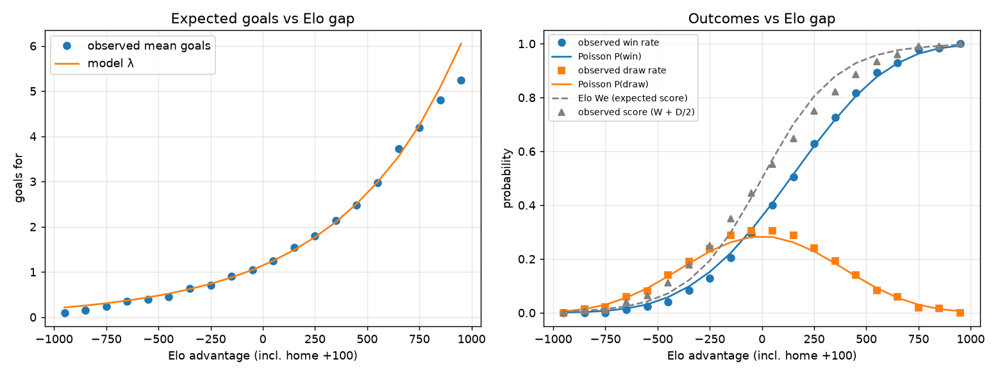

# IntSoccerPredictor

A Monte Carlo simulator for international soccer tournaments. It rates every team with the
[World Football Elo Ratings](https://eloratings.net), turns the rating gap of each match into a
Poisson scoreline, updates the ratings as the simulated tournament unfolds, and repeats the whole
tournament 100,000 times to estimate each team's chance of winning its group, reaching each
knockout round, and lifting the trophy.

The first target is a replay of the **2026 FIFA World Cup** from the ratings as they stood on
10 June 2026, scored against what actually happened. UEFA Euro 2028 and Copa América 2028 will
run on the same code once their fields and formats are known.

## Why

I watched the 2026 World Cup and wondered how well a simple, transparent model could have called
it. Elo ratings are among the strongest public predictors of international results, and the
eloratings.net system publishes both the ratings and every match that produced them, so the
whole pipeline can be checked against real data at each step.

## How it works

For every match in a simulated tournament:

1. Take both teams' current Elo ratings (already updated by earlier simulated matches).
2. Compute the rating gap, adding 100 points to a host playing at home.
3. Convert the gap into expected goals for each side using a curve fitted to 7,500 real matches
   from 2010 to June 2026: `goals = exp(0.136 + 0.00176 × gap)`. Equal teams expect 1.15 goals
   each; every 100 rating points multiplies a team's rate by 1.19.
4. Draw both scores from Poisson distributions. Win, draw or loss follows from the score, so draws
   happen at their real frequency. Knockout ties go to extra time and then penalties.
5. Update both ratings with the eloratings.net formula `R' = R + K·G·(W − We)`, where K is 60 for
   World Cup matches and G grows with the margin of victory, then move on to the next match.

Repeat the tournament many times and count outcomes.

The fitted curve reproduces observed goals and win rates across the entire range of rating gaps.
It also shows why the scoreline model matters: Elo's own win expectancy (dashed) overstates how
often a favourite actually gets the result.



## Status

| Done | Next |
|---|---|
| Data layer for eloratings.net TSV files | Report charts and the 2026 backtest |
| Elo engine, verified against the site's own point exchanges | |
| Pre-tournament ratings for all 48 teams, groups, all 104 real results, full bracket and FIFA's 495-row third-place table | |
| Goals model fitted and calibrated | |
| Single-match simulator with extra time and penalties, and the tournament definition loader | |
| Group standings with the 2026 tiebreakers, verified to reproduce the real 32 qualifiers | |
| Knockout bracket with FIFA's third-place table, verified to reproduce all 32 real knockout pairings | |
| Full single-tournament simulation with Elo carried match to match and host home advantage | |
| Monte Carlo runner that stores every match of every simulation as Parquet | |
| Report data layer: ten views (group odds, fate table, paradoxes, most-probable bracket, reality check) as CSV/JSON | |

Details and the full component list are in [docs/ROADMAP.md](docs/ROADMAP.md).

### Website

The simulations are published at [intsoccerpredictor.vercel.app](https://intsoccerpredictor.vercel.app):
the 2026 World Cup in eight chapters — who wins it, the group stage, the bracket, the hosts, the
underdogs, the paradoxes, pick a team, and how it works. It is plain HTML, CSS and JavaScript under
`site/`, with no build step and no framework. Every number on it is read from
`site/data/wc2026/*.json`, written by `intsoccer report --site` and committed alongside the pages,
so the site never computes a statistic of its own; the views themselves are specified in
[docs/REPORTS.md](docs/REPORTS.md). Vercel deploys it from `main` through its GitHub integration,
with the project's root directory set to `site/`; every pull request gets a preview deployment.

## Quick start

```bash
git clone https://github.com/tcaetanoa-droid/IntSoccerPredictor.git
cd IntSoccerPredictor
python3 -m venv .venv && source .venv/bin/activate   # keep the clone out of iCloud-synced folders
pip install -e ".[dev]"

pytest                                   # run the test suite
intsoccer fetch --teams ES AR EN         # download current ratings and team histories
intsoccer snapshot --date 2026-06-11 --label wc2026   # ratings as of the eve of the World Cup
intsoccer fit                            # refit the goals model and draw the calibration chart
intsoccer simulate --n 100000 --seed 2026   # 100k World Cups -> output/wc2026/ (~8 min)
intsoccer report --run output/wc2026        # the report views -> output/wc2026/report/
```

Requires Python 3.11 or newer. Downloads are cached in `data/raw/` and simulation runs are
written to `output/` (neither is committed).

## Project layout

```
src/intsoccer/
  data/        fetch.py (cached downloads into data/raw/), parse.py (headerless TSVs, Unicode
               minus), schema.py (column layouts, K by match type), snapshot.py (a team's rating
               on a date = rating after its last match before it; infer_groups from fixtures)
  elo/         core.py: rating_diff (+100 home), expected_score, goal_multiplier, update
  model/       goals.py (GoalsModel, outcome_probs), fit.py (Poisson regression, diagnostics
               chart), match.py (simulate_match: scoreline, extra time, shootout, Elo update,
               vectorised over simulations)
  tournament/  format.py (load_tournament: YAML + third-place table, fully cross-validated),
               group.py (standings, tiebreaker rulesets, best-thirds ranking), knockout.py
               (bracket resolution incl. third-place table), simulate.py (one whole tournament)
  montecarlo/  run.py (n simulations, each seeded as [seed, i] so any one can be regenerated;
               matches / teams / sims Parquet tables plus a summary CSV under output/<name>/)
  report/      tables.py (views 1-8), bracket.py (most-probable bracket, reality overlay),
               build.py (writes output/<name>/report/*.csv|json); the views are specified in
               docs/REPORTS.md
  backtest/    not started
  cli.py       intsoccer fetch | snapshot | fit | simulate | report
site/               the static website (plain HTML/CSS/JS), reads site/data/<name>/*.json
data/tournaments/   wc2026.yaml (annotated schema example), wc2026_results.csv (all 104 real
                    results with pre-match ratings), wc2026_third_place_table.csv (FIFA Annex C,
                    495 rows); euro2028 / copa2028 placeholders awaiting their draws
data/snapshots/     committed rating snapshots, e.g. 2026-06-10_wc2026.csv
data/model_params.yaml   fitted goals-model parameters
docs/               formula reference, data-source reference, 2026 format rules, roadmap
tests/              pytest suite with small real-data fixtures
```

Data flow:

```
eloratings.net TSVs
    ↓  data/fetch.py (cached in data/raw/)
    ↓  data/parse.py
    ├─→ data/snapshot.py  → data/snapshots/<date>_<label>.csv   (ratings on the eve)
    └─→ model/fit.py      → data/model_params.yaml               (goals curve, pre-cutoff only)

data/tournaments/<name>.yaml + snapshot + params
    ↓  tournament/format.py   (validated Tournament)
    ↓  tournament/group.py    (standings, tiebreakers, best thirds)
    ↓  tournament/knockout.py (bracket, third-place table)
    ↓  tournament/simulate.py (one whole tournament, Elo carried match to match)
    ↓  model/match.py         (one match, vectorised over simulations)
    ↓  montecarlo/            (n runs → output/<name>/{matches,teams,sims}.parquet + summary.csv)
    ↓  report/                (output/<name>/report/: one CSV/JSON per view, charts to come)
    ↓  backtest/              (Brier / log-loss vs the real 2026 results)         [todo]
```

Tests check the code against reality wherever the data allows. `tests/fixtures/` holds small real
TSV slices; the Elo tests reconstruct pre-match ratings from them and compare the update with the
site's own points column. The match-simulator tests run 200,000 simulations and compare outcome
frequencies with the analytic Poisson probabilities. The loader tests read the real `wc2026.yaml`
and cross-check its groups against the real results and the ratings snapshot.

## Data and credits

All ratings and match histories come from [eloratings.net](https://eloratings.net) (World Football
Elo Ratings). Tournament regulations are taken from FIFA's 2026 World Cup regulations as
documented on Wikipedia. Flag images are served by flagcdn.com. This is a personal,
non-commercial project and is not affiliated with any of them.

Teams are identified everywhere by eloratings.net's own two-letter codes, which are not ISO codes.
Some are easy to get wrong: `SQ` is Scotland (`SC` is Seychelles), `IE` is the Republic of Ireland
(`IR` is Iran), `EN` is England and `WA` is Wales. The full lookup is `en.teams.tsv`, downloaded
into `data/raw/` by `intsoccer fetch`.

## License

Not chosen yet. Until one is added, all rights reserved.
